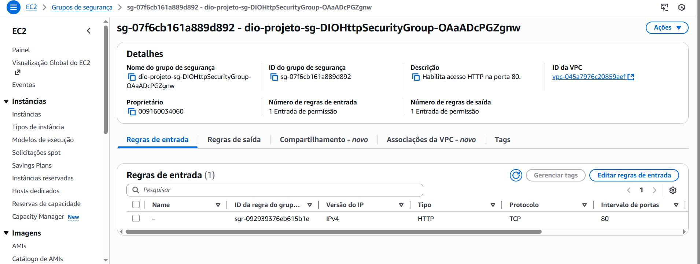

# AWS-CloudFormation
# Desáfio AWS - Infraestrutura como código usando CloudFormation.

##  Objetivo do Projeto

Este laboratório demonstra a aplicação prática dos conceitos de **Infraestrutura como Código (IaC)**, utilizando o **AWS CloudFormation** para provisionar um recurso de rede fundamental: um **Security Group**. O projeto validou a capacidade de definir, criar e verificar a infraestrutura de forma declarativa.

##  Tecnologias e Conceitos Aplicados

| Tecnologia/Conceito | Descrição e Aplicação |
| :--- | :--- |
| **AWS CloudFormation** | Serviço de IaC para orquestração declarativa. |
| **JSON** | Formato de template escolhido para maior estabilidade e clareza. |
| **`AWS::EC2::SecurityGroup`** | O recurso provisionado (Regra de firewall). |
| **Validação Via Designer** | Técnica usada para superar erros de codificação de arquivo. |

## 2. Template JSON Utilizado

O template abaixo é a estrutura mínima necessária para criar um Security Group.

### Código: `security_group.json`

```json
{
  "AWSTemplateFormatVersion": "2010-09-09",
  "Description": "Security Group-Desafio DIO.",
  "Resources": {
    "DIOHttpSecurityGroup": {
      "Type": "AWS::EC2::SecurityGroup",
      "Properties": {
        "GroupDescription": "Habilita acesso HTTP na porta 80.",
        "SecurityGroupIngress": [
          {
            "IpProtocol": "tcp",
            "FromPort": 80,
            "ToPort": 80,
            "CidrIp": "0.0.0.0/0"
          }
        ]
      }
    }
  }
}

```
## 3. Evidência de Sucesso na AWS

A criação da Stack foi bem-sucedida.



### Detalhes da Criação:

* **Recurso Criado:** Security Group com nome lógico `DIOHttpSecurityGroup`.
* **Regra Ativada:** Permissão de entrada (Inbound) na **Porta 80 (HTTP)** a partir de **qualquer IP** (`0.0.0.0/0`).
* **Status Final da Stack:** `CREATE_COMPLETE`.

---

## 4. Insights e Aprendizados 

* **Validação da Sintaxe:** O uso do formato **JSON** e a validação via **CloudFormation Designer** foram essenciais para garantir a interpretação correta do template.
* **IaC em Ação:** O template demonstrou como a infraestrutura de rede (regras de firewall) pode ser codificada e provisionada em um único passo.
* **Simplicidade:** O projeto provou que é possível iniciar com CloudFormation usando um template mínimo, focando apenas na seção `Resources`.
